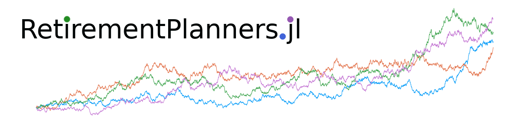

# RetirementPlanner

  [![CodeCov][codecov-img]][codecov-url] 

[codecov-img]: https://codecov.io/github/itsdfish/RetirementPlanners.jl/badge.svg?branch=main
[codecov-url]: https://codecov.io/github/itsdfish/RetirementPlanners.jl?branch=main

This package provides a framework for stress testing retirement and financial plans under a wide range of conditions. A detailed explanation with examples can be found in the [documentation](https://itsdfish.github.io/RetirementPlanners.jl/dev/).

# Disclaimer

Monte Carlo simulations are useful tools for stress testing financial/retirement plans under a wide range of uncertain conditions. As with any model, Monte Carlo simulations are only as good as the assumptions one makes. This package is not intended to be financial advice, but rather an open source tool for planning and research. When in doubt, seek the counsel of a professional financial planner. 