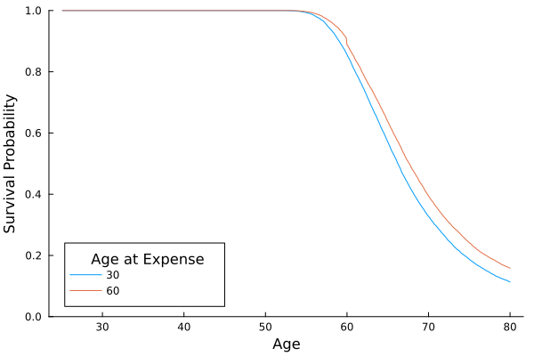

```@setup advanced
using DataFrames
using Distributions
using Random
using RetirementPlanners
using StatsPlots
```
# Overview

The goal of the advanced example is to demonstrate how to perform more complex Monte Carlo simulations of your retirement scenario. The advanced example will cover three new techniques:

1. simulating plausible dynamics in the stock market
2. creating a custom update function for withdrawing money from investments
3. performing the simulation across multiple values of a parameter

Adding these techniques to your toolkit will allow you to simulate more plausible retirement simulations, customize the behavior of the simulation to address your own questions and goals, and systematically compare different scenarios conveniently within the same code. 

# Example 

The advanced example builds upon the intermediate example, making three changes outlined above. 

## Load Packages

The first step is to load the packages required for simulating a retirement scenario and analyzing the results. In the code block below, we will load `RetirementPlanners` to run the simulation, `Distributions` to make the simulation stochastic, and `StatsPlots` to plot the results of the simulation. 

```julia
using DataFrames
using Distributions
using Random
using RetirementPlanners
using StatsPlots

Random.seed!(574)
```

## Create Model

The `Model` object defines the parameters and behavior of the retirement investment simulation. As in the basic example, you must enter a value for the following keyword parameters:

- `Δt`: the time step in years 
- `start_age`: the age of the person at the beginning of the simulation
- `duration`: the number of years to simulate
- `start_amount`: the amount of money in investments at the beginning of the simulation

In this example, we will use the same timing paramers used in the basic example: we will assume you start saving for retirement at age 25 with a modest initial amount of `$`10,000. The simulation will update on a monthy basis and continue for 55 years until you reach age 80. 

### Withdraw

```julia 
function custom_withdraw(
        model::AbstractModel, 
        t;
        start_age, 
        age_at_expense,
        expense,
        distribution
    )
    # make withdraw for major expense if possible
    if age_at_expense == t
        model.state.withdraw_amount = expense
        if model.state.net_worth < expense
            model.state.withdraw_amount = model.state.net_worth
        else
            model.state.withdraw_amount = expense
        end
    # after specified start age, with draw random amount. Otherwise, no withdraw.
    elseif start_age ≤ t 
        withdraw_amount = rand(distribution)
        if model.state.net_worth < withdraw_amount
            model.state.withdraw_amount = model.state.net_worth
        else
            model.state.withdraw_amount = withdraw_amount
        end
    else 
        model.state.withdraw_amount = 0.0
    end
    return nothing
end
```

### Investment

Following the intermediate example, we will use the `variable_investment` function to control investment behavior in the simulation. To account for fluctuations in income and expenses, `variable_investment` allows us to specify a distribution of investment amounts rather than fixed investment amount.  

### Interest

In this example, we will simulate growth the stock market using a stochastic process model called Geometric Brownian Motion (GBM). Brownian motion describes random movement of particles in space when no force is present to move the particles in a specific direction. Although this seems disconnected from stock market behavior, it turns out to be a reasonable model because there is inherent randomness in stock prices as well as a general tendency to grow. If we add a growth rate parameter to Brownian motion and force the price to change proportially to its current value, the result is the GBM. The stochastic differential equation for the GBM is given by:

``X(t) = X(t)[ \mu dt + s \sqrt{dt}],``

where ``X(t)`` is the stock market value at time ``t``, ``dt`` is the infintesimal time step,  ``\mu`` is the average growth rate, and ``s \sim \mathrm{normal}(0,\sigma)`` is normally distributed noise with standard deviation ``\sigma``. The first term ``\mu dt`` represents the average growth rate of the stock market. The second term ``s \sqrt{dt}`` represents the diffusion or *jitter* in the growth rate, which sometimes causes the price to increase or decrease more than the average growth rate. An important implication of multipling the two terms on the right hand side by ``X(t)`` is that growth and volitiliy scale with the current price, and the price cannot be negative.  


The code block below illustrates how to simulate and plot 10 trajectories of the GBM. The growth rate is ``\mu=.07`` with a standard deviation of ``\sigma=.07``, indicating moderately high volitility. In the simulation, the step size is 1 day and the trajectories generated from the model span 10 years.  
```@example advanced 
gdm = GBM(; μ = .07, σ = .07)
trajectories = rand(gdm, 365 * 10, 10; Δt = 1 / 365)
plot(trajectories, leg=false, grid=false)
```

### Inflation

In the example below, we will also use the GBM to simulate inflation in the economy. The primary difference will be the values assigned to the parameters ``\mu`` and ``\sigma``. 

### Model 

```julia 
model = Model(;
    Δt = 1 / 12,
    start_age = 25,
    duration = 55,
    start_amount = 10_000,
    withdraw! = custom_withdraw,
    invest! = variable_investment,
    update_income! = variable_income,
    update_inflation! = dynamic_inflation,
    update_interest! = dynamic_interest 
)
```

## Configure Update Options

We will specify the parameters of the update function in a nested configuration data structure, which passes keyword arguments to their corresponding update funtions. The configuration data structure is a nested `NamedTuple` (i.e., immutable keyword-value pairs), where the keywords in the first level correspond to the keyword inputs of the update functions. For example, the keyword `kw_invest` (short for keyword invest) is a set of keywords passed to the function `fixed_investment`.

The configuration data structure below defines distributions over quanties, such as investment and withdraw amount. Aside from drawling random values from probability distributions, the simulation is the same as that described in the [basic example](basic_example.md).

 The mean monthly investment follows a normal distribution with a mean of `$2,000` and a standard deviation of `$500` to reflect fluctuations in income and expenses. As before, investments are made until an early retirement at age 40. The yearly interest rate on investments has a mean of `.08` with a large standard deviation of `.08` to reflect inherent volitility in the stock market. The yearly inflation rate has a mean of `.035` and a standard deviation of `.015`. Upon retirement at age 40, we assume that you withdraw `$2,200` per month with a standard deviation of `$500` to reflect fluctuation in monthly expenses. 

```julia 
config = (
    # invest parameters
    kw_invest = (
        distribution = Normal(2000, 500),
        end_age = 40,
    ),
    # interest parameters
    kw_interest = (
        gbm = GBM(; μ = .07, σ = .05),
    ),
    # inflation parameters
    kw_inflation = (
        gbm = GBM(; μ = .035, σ = .005),
    ),
    # withdraw parameters 
    kw_withdraw = (
        age_at_expense = [30,60],
        expense = 15_000,
        distribution = Normal(2200, 500),
        start_age = 40,
    )
)
```

## Run Simulation

Now that we have specified the parameters of the simulation, we can use the function `simulate!` to generate retirement numbers and save them to the `Logger` object. As shown below, `simulate!` requires our model object, the logger, and the number of repetitions. The optional configuration object is passed as a variable keyword using `; config...`, which maps the nested keywords in the `NamedTuple` to the corresponding keywords defined in the `simulate!` method signature. 

```julia
# perform the grid search for age_at_expense using 5000 reps per condition
results = grid_search(model, Logger, 10_000; config)
# convert output to data frame
df = to_dataframe(model, results)
```

```julia 
# code surival at each time point as true or false
df.survived = df.net_worth .> 0
# compute the surival probability as a function of age at expense and time
df_survival = combine(groupby(df, [:withdraw_age_at_expense,:time]), :survived => mean => :survival_prob)
```
The code block below plots five simulation runs. As you can see, there is marked variability between the simulation runs, particularly during the retirement phase following peak net worth. 

```julia 
@df df_survival plot(:time, :survival_prob, group=:withdraw_age_at_expense,
    ylims=(0,1), legendtitle="Age at Expense", grid=false, xlabel="Age", ylabel="Survival Probability", legend=:bottomleft)
```


