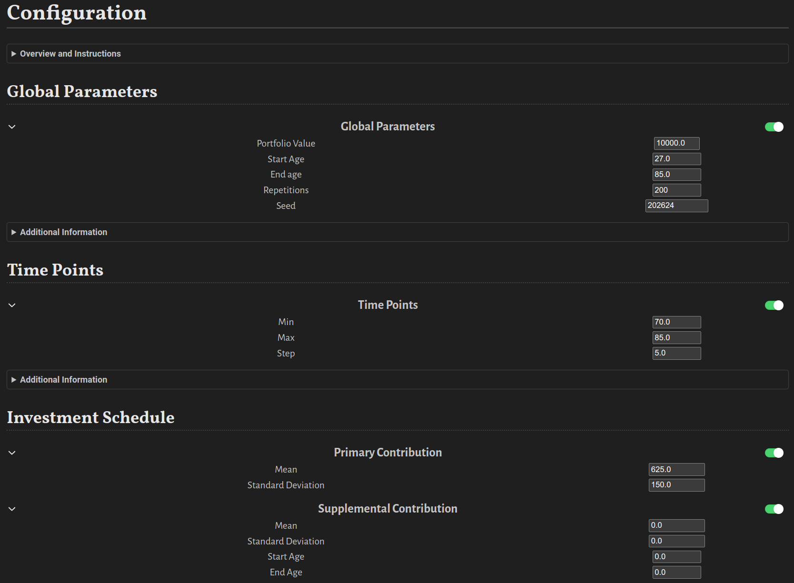

# User-Friendly Interface 

You stress test your retirement plann with a user-friendly interface via the interactive Pluto notebook. As shown in the image below, you can configure the stress test by entering your information into the fields without the need to write code. However, if desired, you can reveal the content of the cells and edit the code for further customization. 



# Instructions

1. [Download](https://github.com/itsdfish/RetirementPlanners.jl/blob/main/notebooks/retirement_stress_test.jl) the Pluto notebook by selecting *download* from the top right menu, pressing `Ctrl + Shift + s`, or via *git clone*.
2. [Download](https://julialang.org/downloads/#current_stable_release) and install the current stable release of Julia programming language. 
3. Open Julia and type `]` to enter the package mode. Next, type `add Pluto` to install the Pluto notebook package:

```julia
(@v1.10) pkg> add Pluto
   Resolving package versions...
    Updating `~/.julia/environments/v1.10/Project.toml`
  [c3e4b0f8] + Pluto v0.19.42
    Updating `~/.julia/environments/v1.10/Manifest.toml`
  [5218b696] + Configurations v0.17.6
  [21656369] + ExpressionExplorer v1.0.2
  [55351af7] + ExproniconLite v0.10.8
  [fb4132e2] + FuzzyCompletions v0.5.4
  [ac1192a8] + HypertextLiteral v0.9.5
  [36869731] + Malt v1.1.1
  [99f44e22] + MsgPack v1.2.1
  [c3e4b0f8] + Pluto v0.19.42
  [72656b73] + PlutoDependencyExplorer v1.0.4
  [91cefc8d] + PrecompileSignatures v3.0.3
  [410a4b4d] + Tricks v0.1.8

(@v1.10) pkg> 
```

4 . Add personal registry for user *itsdfish* by pasting 

```julia
registry add https://github.com/itsdfish/Registry.jl
```
into the terminal. It should look similar to this:

```julia
(@v1.10) pkg> registry add https://github.com/itsdfish/Registry.jl
     Cloning registry from "https://github.com/itsdfish/Registry.jl"
       Added registry `Registry` to `~/.julia/registries/Registry`
```

5 . Press `Backspace` to exit the package mode and paste 

```julia
using Pluto; Pluto.run()
```
into the terminal. The result should look similar to this:

```julia
julia> using Pluto; Pluto.run()
[ Info: Loading...
┌ Info: 
└ Opening http://localhost:1234/?secret=NCNMxi9Y in your default browser... ~ have fun!
┌ Info: 
│ Press Ctrl+C in this terminal to stop Pluto
└ 
```
This will launch the Pluto notebook in your browser. 

6 . In the welcome page for Pluto, under *Open a notebook*, navigate to `retirement_stress_test.jl` on your system and click enter. After the notebook loads, click *run notebook code*. The initial run will require more time than subsequent runs due to installation and compilation. 