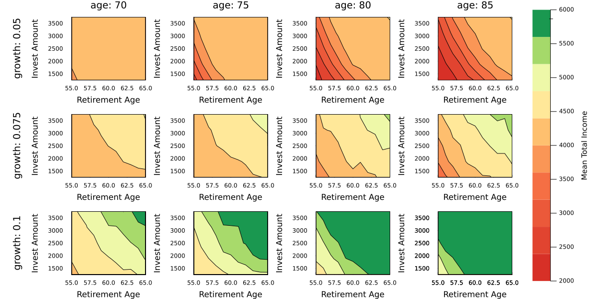

```@setup plotting
using Distributions
using Plots
using RetirementPlanners
```

# Plotting Support

Currently, `RetirementPlanners.jl` provides two specialized plotting functions: `plot_gradient` and `plot_sensitivity`. Each plotting function is illustrated below using the code detailed in the [basic example](basic_example.md) and the [advanced example](advanced_example.md). For ease of presentation, only key elements of the code are visible by default. The code to setup the simulation can be revealed by clicking on the arrow button. 

## Gradient Plot 

 The function `plot_gradient` is used to plot the distribution of a quantity across time. Some examples include, net worth and total income. This functionality is useful in cases involving thousands of simulations, which would lead to overplotting. `plot_gradient` overcomes this challenge by representing variability as a density gradient, where darker regions correspond to more likely trajectories. `plot_gradient` is conditionally loaded into your active session when `RetirementPlanners` and `Plots` are loaded. The example below shows a gradient density plot for 1000 simulations. The full set of code can be seen by expanding the hidden code under *Show Code*.


```@raw html
<details>
<summary><b>Show Code</b></summary>
```
```@example plotting
using Distributions
using Plots
using RetirementPlanners

# montly contribution 
contribution = (50_000 / 12) * 0.15
# configuration options
config = (
    # time step in years 
    Δt = 1 / 12,
    # start age of simulation 
    start_age = 27,
    # duration of simulation in years
    duration = 58,
    # initial investment amount 
    start_amount = 10_000,
    # withdraw parameters 
    kw_withdraw = (withdraws = Transaction(;
        start_age = 60,
        amount = AdaptiveWithdraw(;
            min_withdraw = 2200,
            percent_of_real_growth = 0.15,
            income_adjustment = 0.0,
            volitility = 0.05
        )
    ),),
    # invest parameters
    kw_invest = (investments = Transaction(;
        start_age = 27,
        end_age = 60,
        amount = Normal(contribution, 100)
    ),),
    # interest parameters
    kw_market = (
        # dynamic model of the stock market
        gbm = VarGBM(;
            # non-recession parameters
            αμ = 0.070,
            ημ = 0.010,
            ασ = 0.035,
            ησ = 0.010,
            # recession parameters
            αμᵣ = -0.05,
            ημᵣ = 0.010,
            ασᵣ = 0.035,
            ησᵣ = 0.010
        ),
        recessions = Transaction(; start_age = 0, end_age = 0)
    ),
    # inflation parameters
    kw_inflation = (gbm = VarGBM(; αμ = 0.035, ημ = 0.005, ασ = 0.005, ησ = 0.0025),),
    # income parameters 
    kw_income = (income_sources = Transaction(; start_age = 67, amount = 2000),)
)
# setup retirement model
model = Model(; config...)
times = get_times(model)
n_reps = 1000
n_steps = length(times)
logger = Logger(; n_steps, n_reps)
simulate!(model, logger, n_reps)

# plot of survival probability as a function of time
survival_probs = mean(logger.net_worth .> 0, dims = 2)
```
```@raw html
</details>
```

```@example plotting 
income_plot = plot_gradient(
    times,
    logger.total_income;
    xlabel = "Age",
    ylabel = "Total Income",
    xlims = (config.kw_withdraw.withdraws.start_age, times[end]),
    n_lines = 0,
    color = :blue
)
```

## Sensitivity Plot 

In many cases, it is informative to perform a sensitivity analysis of your retirement strategy. For example, you might want to know to what extent your net worth varies according to changes in investment amount and number of years investing. The function `plot_sensitivity` uses a contour plot visualize the effect of two variables on another variable.

In the code block below, invest amount and number of years investing are varied independently across a range of values and the survival probability at the end of the simulation is color coded from low in red to high in green. As you might expect, you are more likely run out of money by withdrawing more and investing less. The benefit of a sensitivity analysis is that it provides details about the magnitude of these changes. 

As shown in the configuration below, we specificy a vector of values for the variables we wish to vary. The configuration is passed to a function called `grid_search`, which runs the simulation for all combinations of the two variables. Click the arrow to reveal the details. 

```julia
# montly contribution 
contribute(x, r) = (x / 12) * r
salary = 50_000

withdraws = map(
    a -> Transaction(;
        start_age = a,
        amount = AdaptiveWithdraw(;
            min_withdraw = 2200,
            percent_of_real_growth = 0.15,
            income_adjustment = 0.0,
            volitility = 0.05
        )
    ),
    55:65
)

investments = [
    Transaction(; start_age = 27, end_age = a, amount = Normal(contribute(5e4, p), 100))
    for p ∈ 0.10:0.05:0.30 for a ∈ 55:65
]

# configuration options
config = (
    # time step in years 
    Δt = 1 / 12,
    # start age of simulation 
    start_age = 27,
    # duration of simulation in years
    duration = 58,
    # initial investment amount 
    start_amount = 10_000,
    # withdraw parameters 
    kw_withdraw = (; withdraws),
    # invest parameters
    kw_invest = (; investments),
    # interest parameters
    kw_market = (gbm = VarGBM(; αμ = 0.070, ημ = 0.010, ασ = 0.035, ησ = 0.010),),
    # inflation parameters
    kw_inflation = (gbm = VarGBM(; αμ = 0.035, ημ = 0.005, ασ = 0.005, ησ = 0.0025),),
    # income parameters 
    kw_income = (income_sources = Transaction(; start_age = 67, amount = 2000),)
)
```

```@raw html
<details>
<summary><b>Show Code</b></summary>
```
```@example plotting
using DataFrames
using Distributions
using Random
using RetirementPlanners
using StatsPlots

Random.seed!(6522)
# montly contribution 
contribute(x, r) = (x / 12) * r
salary = 50_000

withdraws = map(
    a -> Transaction(;
        start_age = a,
        amount = AdaptiveWithdraw(;
            min_withdraw = 2200,
            percent_of_real_growth = 0.15,
            income_adjustment = 0.0,
            volitility = 0.05
        )
    ),
    55:65
)

investments = [
    Transaction(; start_age = 27, end_age = a, amount = Normal(contribute(5e4, p), 100))
    for p ∈ 0.10:0.05:0.30 for a ∈ 55:65
]

# configuration options
config = (
    # time step in years 
    Δt = 1 / 12,
    # start age of simulation 
    start_age = 27,
    # duration of simulation in years
    duration = 58,
    # initial investment amount 
    start_amount = 10_000,
    # withdraw parameters 
    kw_withdraw = (; withdraws),
    # invest parameters
    kw_invest = (; investments),
    # interest parameters
    kw_market = (gbm = VarGBM(; αμ = 0.070, ημ = 0.010, ασ = 0.035, ησ = 0.010),),
    # inflation parameters
    kw_inflation = (gbm = VarGBM(; αμ = 0.035, ημ = 0.005, ασ = 0.005, ησ = 0.0025),),
    # income parameters 
    kw_income = (income_sources = Transaction(; start_age = 67, amount = 2000),)
)

yoked_values =
    [Pair((:kw_withdraw, :withdraws, :start_age), (:kw_invest, :investments, :end_age))]
results = grid_search(Model, Logger, 1000, config; yoked_values);
df = to_dataframe(Model(; config...), results)
df.survived = df.net_worth .> 0
df.retirement_age = map(x -> x.end_age, df.invest_investments)
df.mean_investment = map(x -> x.amount.μ, df.invest_investments)
```
```@raw html
</details>
```
```@example plotting
plot_sensitivity(
    df,
    [:retirement_age, :mean_investment],
    :survived,
    xlabel = "Age",
    ylabel = "Invest Amount",
    colorbar_title = "Surival Probability"
)
```
The example below shows how to make a grid of plots at multiple time points by passing a vector or unit range to the `age` keyword. To ensure each subplot has the same scale, pass lower and upper bounds to the `clims` keyword.

```@example plotting
plot_sensitivity(
    df,
    [:retirement_age, :mean_investment],
    :survived,
    xlabel = "Age",
    ylabel = "Invest Amount",
    colorbar_title = "Surival Probability",
    colorbar = false,
    clims = (0, 1),
    age = 70:5:85
)
```

```@raw html
<details>
<summary><b>All Code</b></summary>
```
```julia 
###############################################################################################################
#                                           load dependencies
###############################################################################################################
cd(@__DIR__)
using Pkg
Pkg.activate("..")
using Distributions
using DataFrames
using Plots
using RetirementPlanners
using StatsPlots
###############################################################################################################
#                                           setup simulation
###############################################################################################################
# montly contribution 
contribute(x, r) = (x / 12) * r
salary = 50_000

withdraws = map(
    a -> Transaction(;
        start_age = a,
        amount = AdaptiveWithdraw(;
            min_withdraw = 2200,
            percent_of_real_growth = 0.15,
            income_adjustment = 0.0,
            volitility = 0.05
        )
    ),
    55:65
)

investments = [
    Transaction(; start_age = 27, end_age = a, amount = Normal(contribute(5e4, p), 100))
    for p ∈ 0.10:0.05:0.30 for a ∈ 55:65
]

# configuration options
config = (
    # time step in years 
    Δt = 1 / 12,
    # start age of simulation 
    start_age = 27,
    # duration of simulation in years
    duration = 58,
    # initial investment amount 
    start_amount = 10_000,
    # withdraw parameters 
    kw_withdraw = (; withdraws),
    # invest parameters
    kw_invest = (; investments),
    # interest parameters
    kw_market = (
        gbm = VarGBM(;
            αμ = 0.070,
            ημ = 0.010,
            ασ = 0.035,
            ησ = 0.010,
            αμᵣ = -0.05,
            ημᵣ = 0.010,
            ασᵣ = 0.035,
            ησᵣ = 0.010
        ),
        Transaction(; start_age = 0, end_age = 0)
    ),
    # inflation parameters
    kw_inflation = (gbm = VarGBM(; αμ = 0.035, ημ = 0.005, ασ = 0.005, ησ = 0.0025),),
    # income parameters 
    kw_income = (income_sources = Transaction(; start_age = 67, amount = 2000),)
)
###############################################################################################################
#                                           run simulation
###############################################################################################################
yoked_values =
    [Pair((:kw_withdraw, :withdraws, :start_age), (:kw_invest, :investments, :end_age))]
results = grid_search(Model, Logger, 1000, config; yoked_values);
df = to_dataframe(Model(; config...), results)
df.survived = df.net_worth .> 0
df.retirement_age = map(x -> x.end_age, df.invest_investments)
df.mean_investment = map(x -> x.amount.μ, df.invest_investments)
df1 = combine(groupby(df, [:retirement_age, :mean_investment, :time]), :net_worth => mean)
df2 = combine(groupby(df, [:retirement_age, :mean_investment, :time]), :survived => mean)
###############################################################################################################
#                                            plot results 
###############################################################################################################
@df df1 plot(
    :time,
    :net_worth_mean,
    group = (:retirement_age, :mean_investment),
    ylims = (0, 2e6),
    legend = false,
    legendtitle = "withdraw age",
    grid = false,
    xlabel = "Age",
    ylabel = "Mean Net Worth"
)

@df df2 plot(
    :time,
    :survived_mean,
    group = (:retirement_age, :mean_investment),
    ylims = (0, 1),
    grid = false,
    xlabel = "Age",
    layout = (4, 1),
    legend = :bottomleft,
    ylabel = "Survival Probability"
)

plot_sensitivity(
    df,
    [:retirement_age, :mean_investment],
    :survived,
    xlabel = "Age",
    ylabel = "Invest Amount",
    colorbar_title = "Surival Probability"
)
```
```@raw html
</details>
```


As shown below, you can also create a grid of contour plots in which the rows correspond to a variable of interest and the columns correspond to specified time points. 

```julia
income_plots = plot_sensitivity(
    df,
    [:retirement_age, :mean_investment],
    :total_income,
    :mean_growth_rate;
    row_label = "growth:",
    xlabel = "Retirement Age",
    ylabel = "Invest Amount",
    colorbar_title = "Mean Total Income",
    clims = (2000, 6000),
    age = 70:5:85,
    size = (1200, 600)
)
```

The complete code for this example can be found below by expanding the tab labeled *All Code*.



```@raw html
<details>
<summary><b>All Code</b></summary>
```
```julia 
###############################################################################################################
#                                           load dependencies
###############################################################################################################
cd(@__DIR__)
using Pkg
Pkg.activate("..")
using Distributions
using DataFrames
using Plots
using RetirementPlanners
using Revise
using StatsPlots
###############################################################################################################
#                                           setup simulation
###############################################################################################################
# montly contribution 
contribute(x, r) = (x / 12) * r
# enter your salary here
salary = 150_000

# withdraws = map(
#     a -> Transaction(;
#         start_age = a,
#         amount = Normal(2200, 200)
#     ),
#     55:65
# )

withdraws = map(
    a -> Transaction(;
        start_age = a,
        amount = AdaptiveWithdraw(;
            min_withdraw = 2200,
            percent_of_real_growth = 0.15,
            income_adjustment = 0.0,
            volitility = 0.05
        )
    ),
    55:65
)

investments = [
    Transaction(; start_age = 49, end_age = a, amount = Normal(contribute(salary, p), 100))
    for p ∈ 0.10:0.05:0.30 for a ∈ 55:65
]

gbm = map(
    αμ -> VarGBM(;
        αμ,
        ημ = 0.010,
        ασ = 0.035,
        ησ = 0.010,
        αμᵣ = -0.05,
        ημᵣ = 0.010,
        ασᵣ = 0.035,
        ησᵣ = 0.010
    ),
    0.05:0.025:0.10
)

# configuration options
config = (
    # time step in years 
    Δt = 1 / 12,
    # start age of simulation 
    start_age = 49,
    # duration of simulation in years
    duration = 40,
    # initial investment amount 
    start_amount = 300_000,
    # withdraw parameters 
    kw_withdraw = (; withdraws),
    # invest parameters
    kw_invest = (; investments),
    # interest parameters
    kw_market = (; gbm,),
    # inflation parameters
    kw_inflation = (gbm = VarGBM(; αμ = 0.035, ημ = 0.005, ασ = 0.005, ησ = 0.0025),),
    # income parameters 
    kw_income = (income_sources = Transaction(; start_age = 67, amount = 2000),)
)
###############################################################################################################
#                                           run simulation
###############################################################################################################
n_reps = 1000
yoked_values =
    [Pair((:kw_withdraw, :withdraws, :start_age), (:kw_invest, :investments, :end_age))]
results = grid_search(Model, Logger, n_reps, config; yoked_values);
df = to_dataframe(Model(; config...), results)
df.survived = df.net_worth .> 0
df.retirement_age = map(x -> x.end_age, df.invest_investments)
df.mean_investment = map(x -> x.amount.μ, df.invest_investments)
df.mean_growth_rate = map(x -> x.αμ, df.market_gbm)
###############################################################################################################
#                                            plot results 
###############################################################################################################
@time survival_plots = plot_sensitivity(
    df,
    [:retirement_age, :mean_investment],
    :survived,
    :mean_growth_rate;
    row_label = "growth:",
    xlabel = "Retirement Age",
    ylabel = "Invest Amount",
    clims = (0, 1),
    colorbar_title = "Survival Probability",
    age = 70:5:85,
    size = (1200, 600)
)

income_plots = plot_sensitivity(
    df,
    [:retirement_age, :mean_investment],
    :total_income,
    :mean_growth_rate;
    row_label = "growth:",
    xlabel = "Retirement Age",
    ylabel = "Invest Amount",
    colorbar_title = "Mean Total Income",
    clims = (2000, 6000),
    age = 70:5:85,
    size = (1200, 600)
)
```
```@raw html
</details>
```